# CloudWatch Agent on EC2 — Evidence Checklist

## Mục đích
File này ghi lại tiến độ hoàn thành bài Hands-On.

---

## Phần 1: Cài đặt Agent Package

### [x] 1.1 Cài đặt Amazon CloudWatch Agent

**Câu lệnh:**
```bash
# Amazon Linux / CentOS / RHEL / Fedora
sudo yum install amazon-cloudwatch-agent -y

# Ubuntu / Debian
sudo apt-get update
sudo apt-get install amazon-cloudwatch-agent -y
```

**Screenshots:**

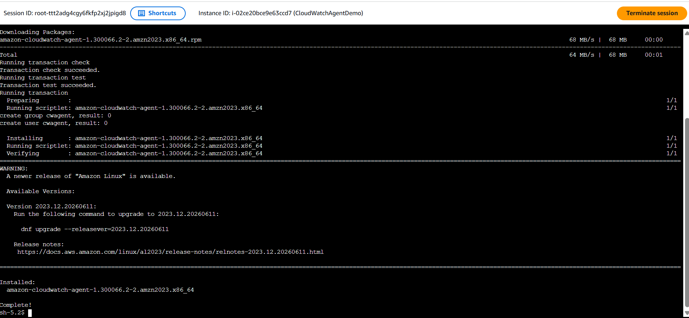
*Terminal — kết quả cài đặt thành công*

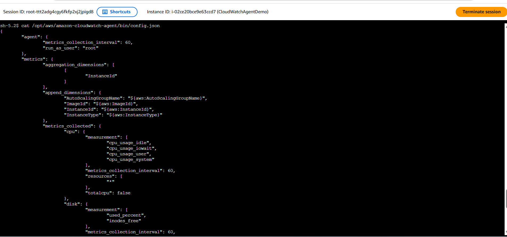
*Binary tồn tại tại `/opt/aws/amazon-cloudwatch-agent/bin/`*

---

## Phần 2: Chạy Configuration Wizard

### [x] 2.1 Chạy Wizard

**Câu lệnh:**
```bash
sudo /opt/aws/amazon-cloudwatch-agent/bin/amazon-cloudwatch-agent-config-wizard
```

**Screenshots:**

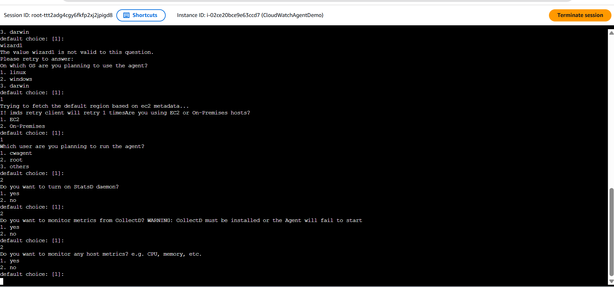
*Wizard đang chạy — trả lời các câu hỏi*

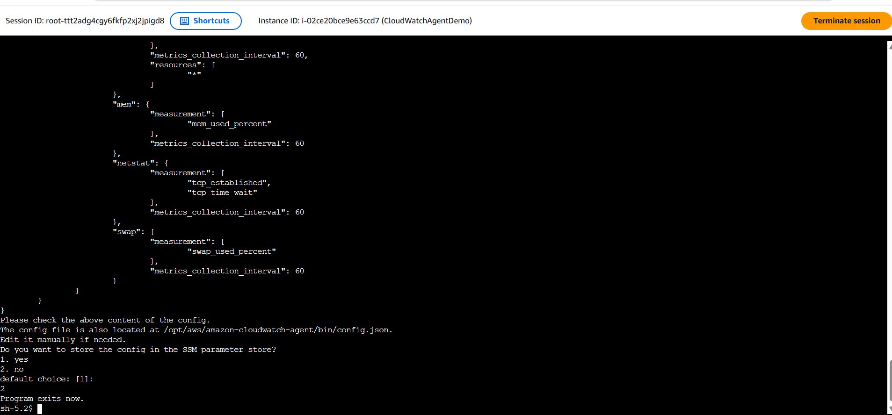
*Wizard hoàn tất — file config.json đã được tạo*

---

## Phần 3: IAM Role cho EC2 (Prerequisite)

> ⚠️ **Bắt buộc:** EC2 phải có IAM Role đính kèm. Nếu chưa có, CloudWatch Agent **sẽ không gửi được metrics** lên CloudWatch.

### [x] 3.1 Tạo IAM Role với CloudWatchAgentServerPolicy

**Screenshots:**

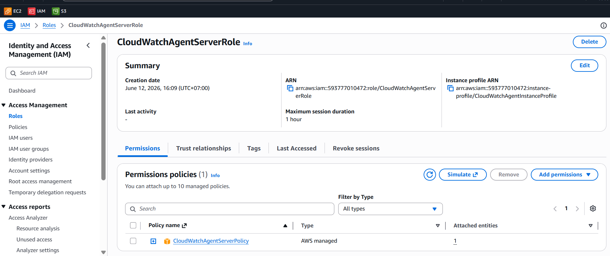
*IAM Console → Roles → Role `CloudWatchAgentServerRole` đã được tạo*

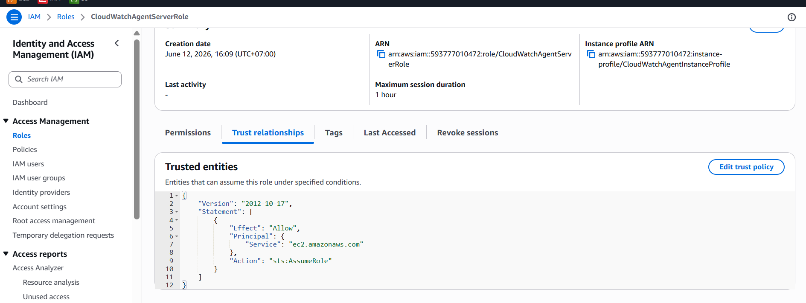
*Tab **Permissions** → Policy `CloudWatchAgentServerPolicy` đã attach*

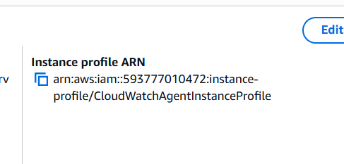
*IAM Role có **Trusted Entities** = `ec2.amazonaws.com`*

---

### [x] 3.2 Đính kèm IAM Role vào EC2 Instance

**Screenshots:**

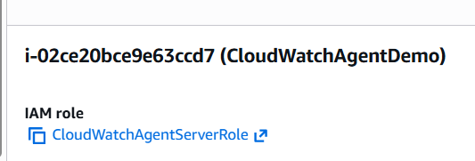
*AWS CLI — kết quả lệnh associate IAM instance profile thành công*

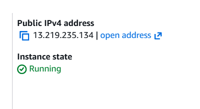
*EC2 Console → Instance Details → IAM Role đã hiển thị*

---

## Phần 4: Khởi động CloudWatch Agent

### [x] 4.1 Enable và Start Service

**Câu lệnh:**
```bash
sudo systemctl enable amazon-cloudwatch-agent
sudo systemctl start amazon-cloudwatch-agent
```

**Screenshots:**

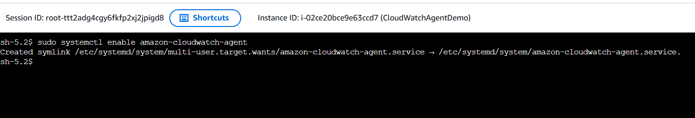
*Output `systemctl enable` — Created symlink*

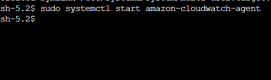
*`systemctl start` không có lỗi*

---

### [x] 4.2 Kiểm tra Service Status

**Câu lệnh:**
```bash
sudo systemctl status amazon-cloudwatch-agent
```

**Screenshots:**

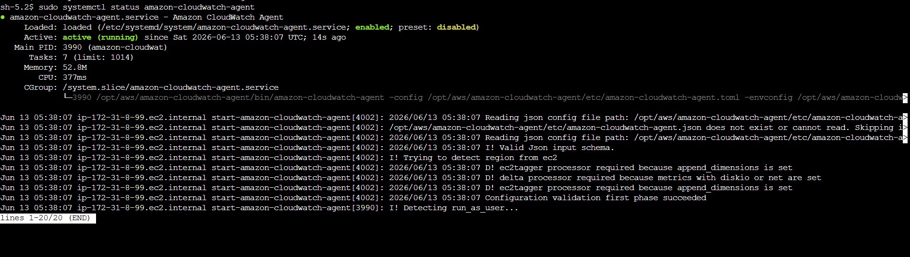
*Output `systemctl status` — hiển thị `active (running)` và Process `amazon-cloudwatch-agent`*

---

## Phần 5: Verify Agent Status

### [x] 5.1 Kiểm tra Agent bằng amazon-cloudwatch-agent-ctl

**Câu lệnh:**
```bash
sudo /opt/aws/amazon-cloudwatch-agent/bin/amazon-cloudwatch-agent-ctl -m ec2 -a status
```

**Screenshots:**

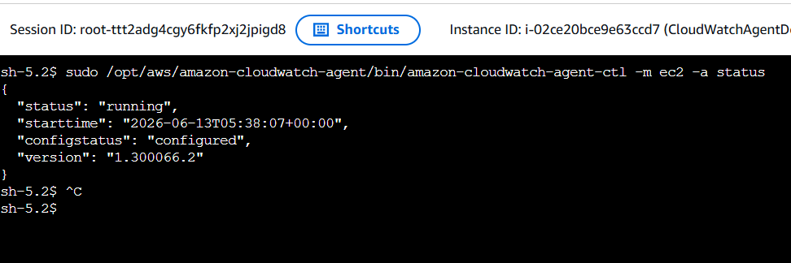
*Output JSON — `"status": "running"` và `"config"` path*

---

### [x] 5.2 Xác nhận Custom Metrics trên CloudWatch Console

**Screenshots:**

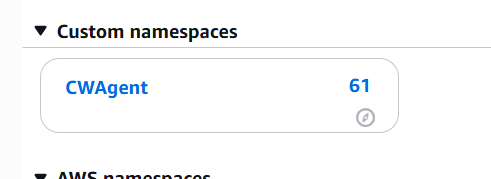
*CloudWatch Console → **Metrics** → Namespace `CWAgent` đã xuất hiện*

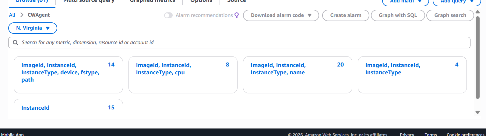
*Danh sách metrics: `mem_used_percent`, `disk_used_percent`, `cpu_usage_idle`...*

---

### [x] 5.3 Xem Dashboard với Custom Metrics

**Screenshots:**

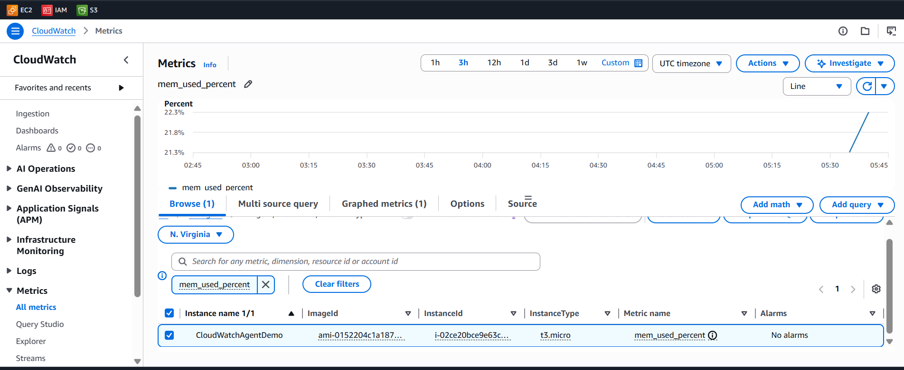
*CloudWatch Dashboard — biểu đồ custom metric (Memory Used %)*

---
