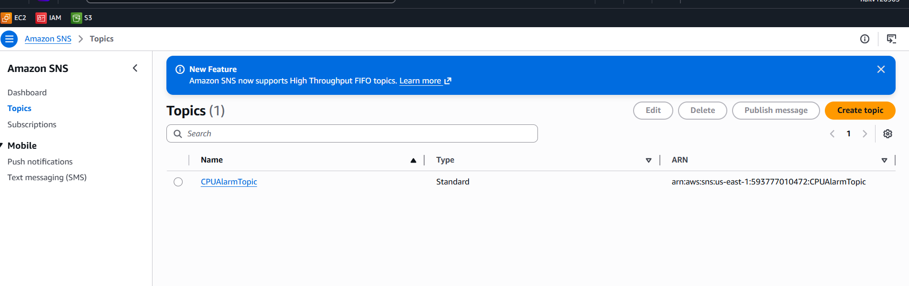
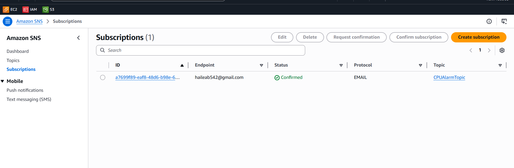
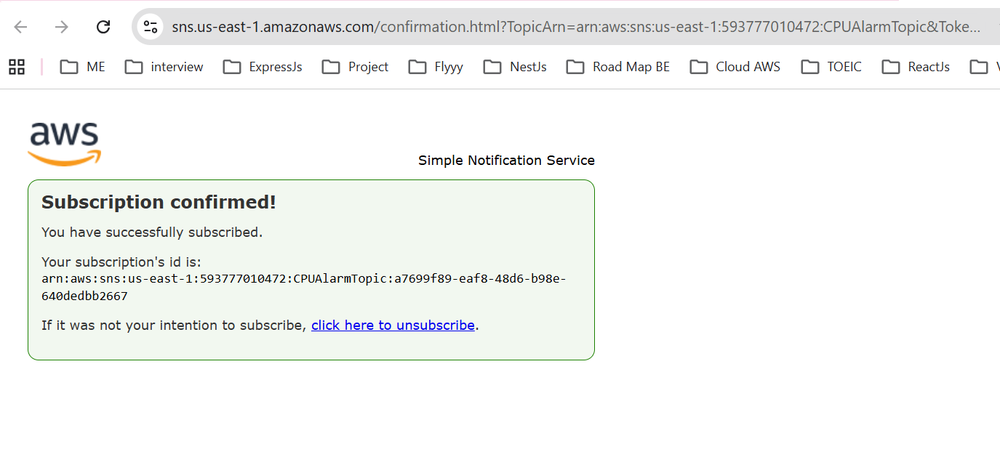
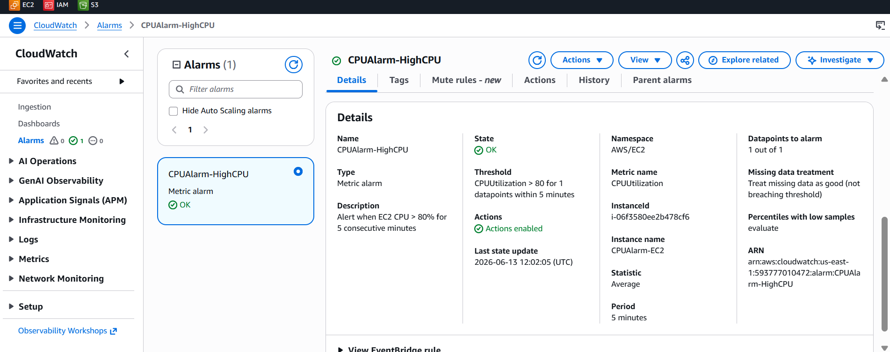
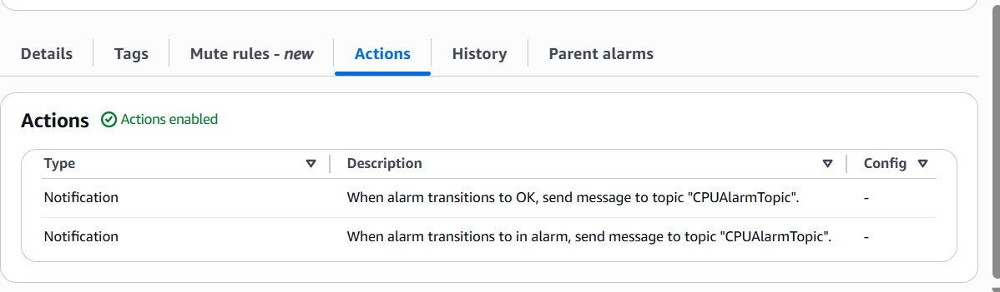
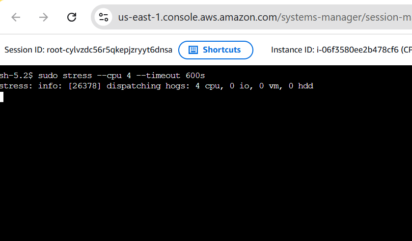
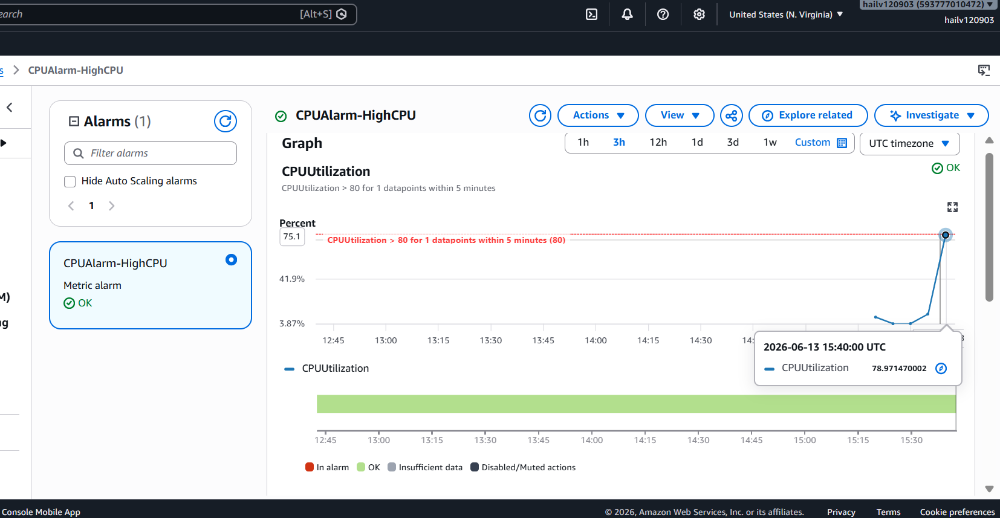
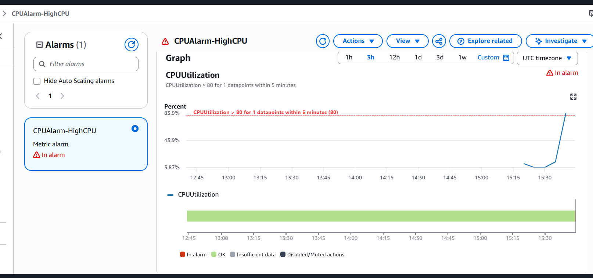
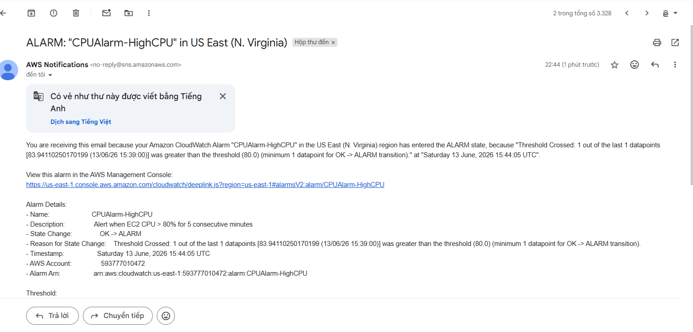

# CPU Alarm — Evidence Checklist

## Mục đích
File này ghi lại tiến độ hoàn thành bài Hands-On.

---

## Thông tin tài nguyên đã tạo

| Tài nguyên | Giá trị |
|-------------|---------|
| **EC2 Instance ID** | `i-06f3580ee2b478cf6` |
| **SNS Topic ARN** | `arn:aws:sns:us-east-1:593777010472:CPUAlarmTopic` |
| **CloudWatch Alarm** | `CPUAlarm-HighCPU` |
| **Email** | `haileab542@gmail.com` |

---

## Phần 1: SNS Topic & Subscription

### [ ] 1.1 Tạo SNS Topic thành công

**Screenshots cần chụp:**


*Trang SNS Topic — ARN hiển thị đầy đủ*

---

### [ ] 1.2 Tạo Email Subscription

**Screenshots cần chụp:**


*Danh sách Subscriptions — Email endpoint `haileab542@gmail.com` với Status: `Pending confirmation`*

---

### [ ] 1.3 Xác nhận Subscription qua email

> ⚠️ **Kiểm tra email `haileab542@gmail.com`** — AWS đã gửi email xác nhận từ `no-reply@sns.amazonaws.com`. Nhấn **Confirm subscription** trong email.

**Screenshots cần chụp:**


*Trang Subscription sau khi xác nhận → Status: `Confirmed`*

---

## Phần 2: CloudWatch Alarm

### [ ] 2.1 Alarm đã tạo thành công

**Cấu hình đã tạo:**

| Trường | Giá trị |
|--------|---------|
| Alarm name | `CPUAlarm-HighCPU` |
| Metric namespace | `AWS/EC2` |
| Metric name | `CPUUtilization` |
| Instance ID | `i-06f3580ee2b478cf6` |
| Statistic | Average |
| Period | 300 seconds (5 minutes) |
| Threshold | 80 % |
| Condition | Greater than |
| Datapoints to alarm | 1 out of 1 |
| Alarm action | `CPUAlarmTopic` (SNS) |
| OK action | `CPUAlarmTopic` (SNS) |

**Screenshots cần chụp:**


*CloudWatch Alarm detail — xem đầy đủ cấu hình alarm*


*Phần Actions — Alarm state và OK state đều trỏ đến `CPUAlarmTopic`*

---

## Phần 3: Kiểm tra hoạt động (Trigger Test)

### [ ] 3.1 Tạo CPU Spike để kích hoạt Alarm

**Cách thực hiện:** SSH vào EC2 và chạy stress test:

```bash
# Kết nối EC2
ssh -i your-key.pem ec2-user@<EC2-PUBLIC-IP>

# Cài stress (Amazon Linux 2023)
sudo dnf install -y stress   # hoặc dùng yum

# Chạy stress test để tăng CPU
sudo stress --cpu 4 --timeout 600s
```

**Lấy EC2 Public IP:**
```bash
aws ec2 describe-instances --instance-ids i-06f3580ee2b478cf6 --query 'Reservations[0].Instances[0].PublicIpAddress' --output text
```

**Screenshots cần chụp:**


*SSH terminal — lệnh `stress --cpu 4` đang chạy*


*CloudWatch Dashboard — CPU Utilization metric đang tăng cao vượt ngưỡng 80%*

---

### [ ] 3.2 Alarm chuyển sang ALARM state

> ⏱️ **Lưu ý:** Alarm cần 5 phút data vượt ngưỡng để chuyển sang ALARM. Sau khi chạy stress ~6-7 phút, alarm sẽ trigger.

**Screenshots cần chụp:**


*CloudWatch Alarms list — trạng thái chuyển từ `OK` hoặc `INSUFFICIENT_DATA` → `ALARM` và biểu đồ CPU với đường ngưỡng 80%*

---

### [ ] 3.3 Nhận Email Alert

> ⚠️ **Kiểm tra email `haileab542@gmail.com`** — Email sẽ có Subject: "Amazon SNS Notification" hoặc "ALARM: CPUAlarm-HighCPU"

**Screenshots cần chụp:**


*Email nhận được từ AWS Notifications (Subject: ALARM) và nội dung email — thông tin chi tiết về alarm (Instance ID, CPU %, Threshold)*

---
