# Root Account Login Alarm — Evidence Checklist

## Mục đích
File này ghi lại tiến độ hoàn thành bài Hands-On **"Alert on AWS Root Account Login"**.

> **Best Practice:** Tài khoản **root** gần như không bao giờ được sử dụng. Bất kỳ lần đăng nhập nào bằng root đều phải trigger alarm ngay lập tức.

---

## Thông tin tài nguyên đã tạo

| Tài nguyên | Giá trị |
|------------|---------|
| **CloudTrail Trail** | `RootAlarmTrail` |
| **CloudWatch Log Group** | `/aws/cloudtrail/RootAlarmTrail` |
| **Metric Filter** | `RootAccountLoginFilter` |
| **Metric Namespace** | `Security` |
| **Metric Name** | `RootAccountLoginCount` |
| **CloudWatch Alarm** | `RootAlarm-RootLogin` |
| **SNS Topic** | `RootAlarmTopic` |
| **Email** | `haileab542@gmail.com` |
| **Region** | `us-east-1` |

---

## Phần 1: CloudTrail — Gửi logs sang CloudWatch

### [x] 1.1 Tạo / chọn CloudTrail Trail

> Truy cập: **CloudTrail → Trails → Create trail**

**Cấu hình:**

| Trường | Giá trị |
|--------|---------|
| Trail name | `RootAlarmTrail` |
| Apply trail to all regions | ✅ Yes |
| Management events | Read + Write |
| Data events | (mặc định) |
| Storage location | **Create new S3 bucket** hoặc dùng bucket có sẵn |

**Screenshots:**

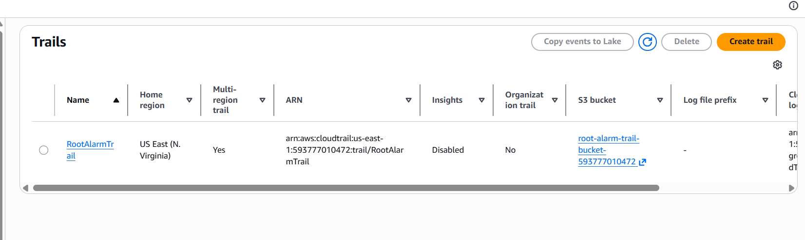
*Trang Create trail — điền tên `RootAlarmTrail`, tick "Apply trail to all regions"*

---

### [x] 1.2 Bật "CloudWatch Logs" trong Trail

> Trong giao diện tạo trail, kéo xuống mục **CloudWatch Logs** và tick **"Enabled"**

**Cấu hình:**

| Trường | Giá trị |
|--------|---------|
| CloudWatch Logs | ✅ Enabled |
| New log group | `/aws/cloudtrail/RootAlarmTrail` (theo convention AWS) |
| IAM Role | **Create new** (CloudTrail sẽ tự tạo role có quyền ghi log) |

**Screenshots:**

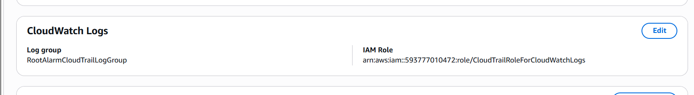
*Mục CloudWatch Logs đã bật, log group `/aws/cloudtrail/RootAlarmTrail` được chọn, IAM Role được tạo*

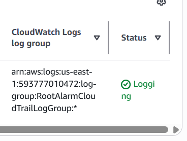
*Trail `RootAlarmTrail` hiển thị ở trang Trails list với status **Logging: ON***

---

## Phần 2: CloudWatch Metric Filter

### [x] 2.1 Tạo Metric Filter

> Truy cập: **CloudWatch → Log groups → `/aws/cloudtrail/RootAlarmTrail` → Actions → Create metric filter**

**Cấu hình Filter Pattern:**

```
{ $.userIdentity.type = "Root" && $.eventType != "AwsServiceEvent" }
```

> **Giải thích pattern:** lọc các sự kiện CloudTrail có `userIdentity.type = "Root"` (nghĩa là đăng nhập/hoạt động bằng root), loại trừ `AwsServiceEvent` (các sự kiện do AWS tự sinh, không phải người dùng).

**Metric details:**

| Trường | Giá trị |
|--------|---------|
| Filter name | `RootAccountLoginFilter` |
| Metric namespace | `Security` |
| Metric name | `RootAccountLoginCount` |
| Metric value | `1` |
| Default value | `0` |
| Unit | Count |

**Screenshots:**

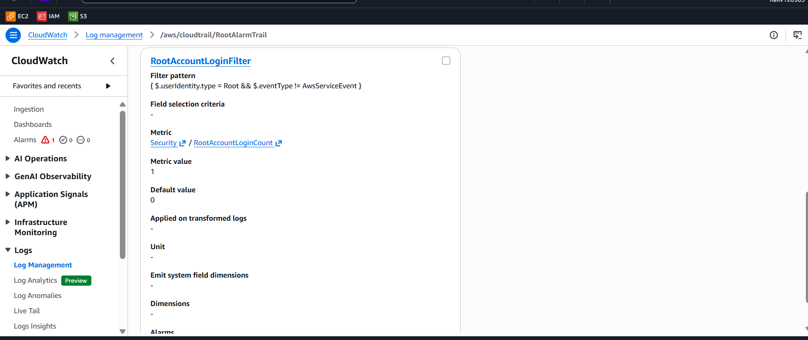
*Trang Define pattern — Filter pattern đã điền đúng*

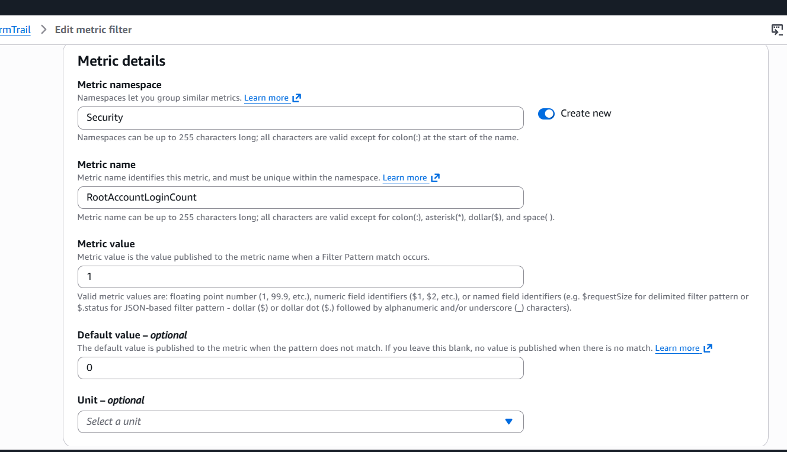
*Trang Assign metric — namespace `Security`, metric name `RootAccountLoginCount`, value `1`*

---

## Phần 3: CloudWatch Alarm

### [x] 3.1 Tạo SNS Topic trước (làm action cho alarm)

> Truy cập: **SNS → Topics → Create topic**

**Cấu hình:**

| Trường | Giá trị |
|--------|---------|
| Type | Standard |
| Name | `RootAlarmTopic` |
| Display name (optional) | `Root Alarm` |

**Tạo Email Subscription:**

| Trường | Giá trị |
|--------|---------|
| Protocol | Email |
| Endpoint | `haileab542@gmail.com` |

> ⚠️ **Kiểm tra email `haileab542@gmail.com`** — AWS gửi email xác nhận từ `no-reply@sns.amazonaws.com`. Nhấn **Confirm subscription** trong email.

**Screenshots:**

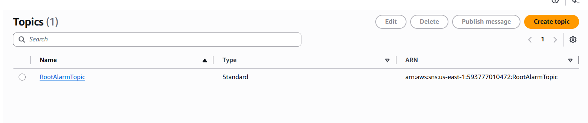
*Trang SNS Topic — ARN `arn:aws:sns:us-east-1:593777010472:RootAlarmTopic`*

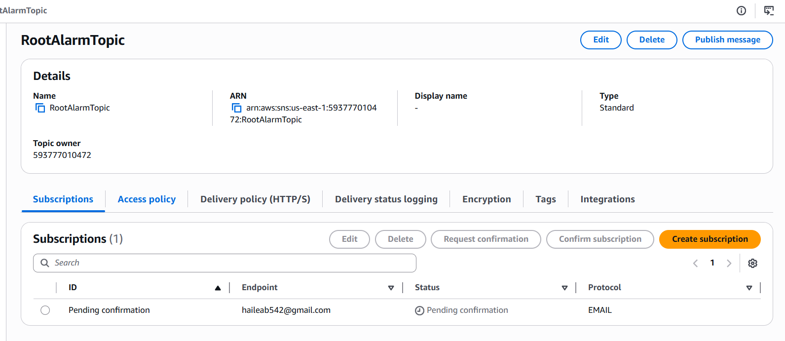
*Subscription list — Email `haileab542@gmail.com`, Status: `Confirmed`*

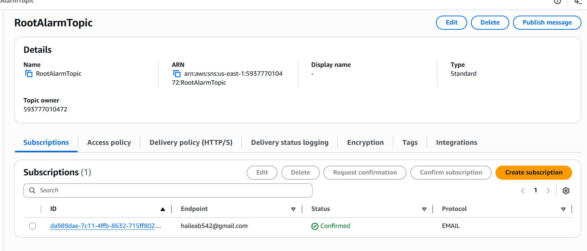
*Chi tiết subscription sau khi confirm*

---

### [x] 3.2 Tạo CloudWatch Alarm

> Truy cập: **CloudWatch → Alarms → Create alarm** → chọn metric `Security → RootAccountLoginCount`

**Cấu hình:**

| Trường | Giá trị |
|--------|---------|
| Alarm name | `RootAlarm-RootLogin` |
| Description | `Alert when AWS root account is used (any single login triggers alarm)` |
| Statistic | Sum |
| Period | **300 seconds (5 minutes)** |
| Threshold type | Static |
| Condition | **Greater than or equal to threshold** |
| Threshold value | **1** |
| Datapoints to alarm | **1 out of 1** |
| Missing data treatment | Treat as missing (do not breach) |

**Alarm actions:**

| Trường | Giá trị |
|--------|---------|
| In alarm → send notification to | `RootAlarmTopic` (SNS) |
| OK action | (optional) `RootAlarmTopic` (SNS) |

**Screenshots:**

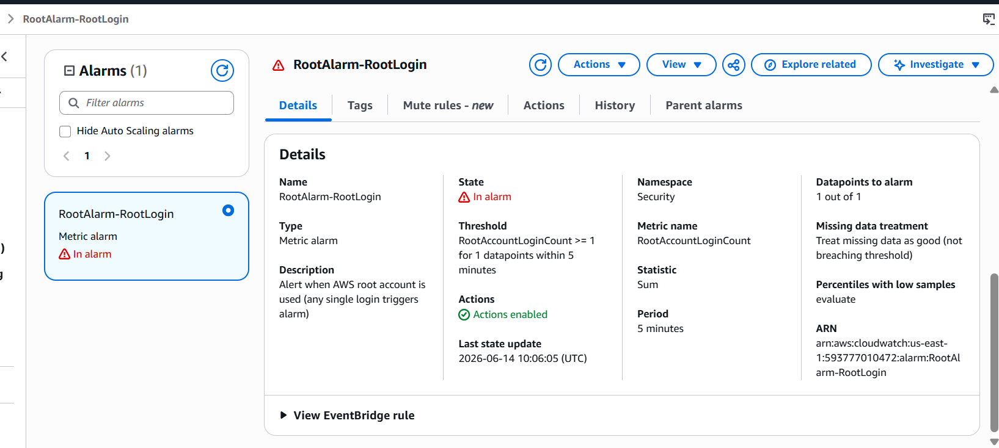
*Trang Define alarm conditions — Threshold ≥ 1, Period 5 minutes, Datapoints 1 of 1*

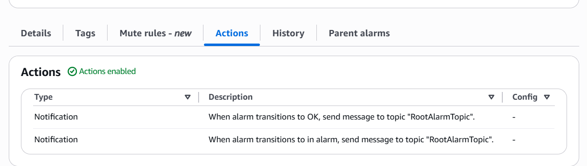
*Trang Configure actions — Alarm state trigger `In alarm`, SNS topic `RootAlarmTopic`*

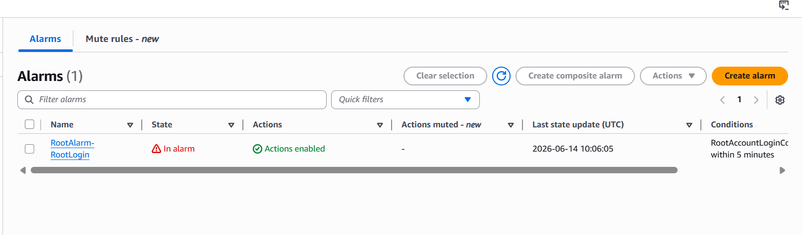
*Trang Review and create — Alarm `RootAlarm-RootLogin` đã được tạo với state `Insufficient data`*

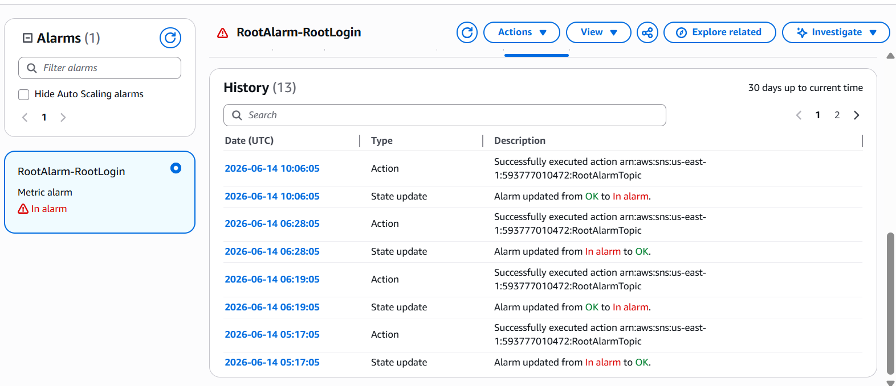
*CloudWatch Alarms list — alarm `RootAlarm-RootLogin` hiển thị với đầy đủ cấu hình*

---

## Phần 4: Kiểm tra hoạt động (Trigger Test)

> ⚠️ **Cảnh báo:** Phần này thực hiện đăng nhập bằng root. Hãy đảm bảo bạn đã chuẩn bị sẵn credentials của root user.

### [x] 4.1 Đăng nhập bằng Root Account

**Cách thực hiện:**

1. Mở một **cửa sổ trình duyệt ẩn danh** (incognito)
2. Truy cập `https://console.aws.amazon.com/`
3. Chọn **"Sign in as root user"**
4. Nhập email + password của **root account**
5. Sau khi đăng nhập thành công → **Sign out** ngay để giảm thiểu rủi ro

---

### [x] 4.2 CloudTrail ghi nhận sự kiện Root login

> Sau khi đăng nhập bằng root, đợi **~5-10 phút** để CloudTrail đẩy log sang CloudWatch.

**Kiểm tra log:**
1. Vào **CloudWatch → Log groups → `/aws/cloudtrail/RootAlarmTrail`**
2. Mở log stream mới nhất
3. Tìm kiếm `userIdentity.type` → phải thấy `"type": "Root"`

**Screenshots:**

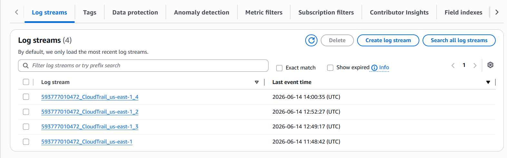
*Log stream mới nhất trong `/aws/cloudtrail/RootAlarmTrail` chứa event root login*

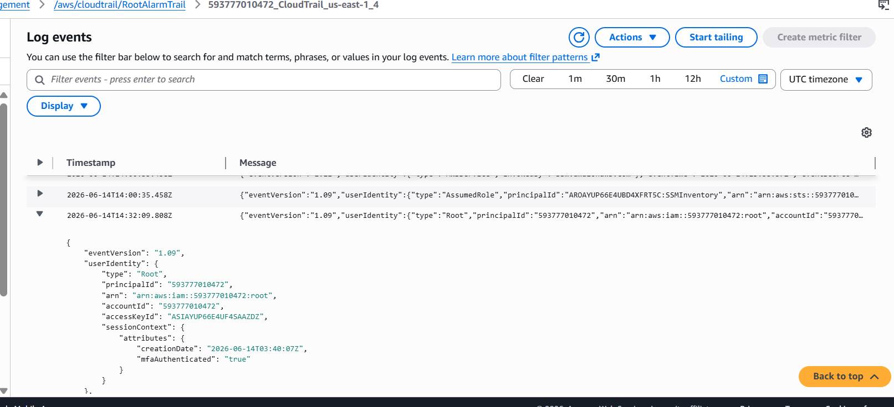
*Nội dung JSON của event: `"userIdentity": { "type": "Root", ... }`*

---

### [x] 4.3 Nhận Email Alert

> ⚠️ **Kiểm tra email `haileab542@gmail.com`** — Email sẽ có Subject: **"ALARM: "RootAlarm-RootLogin" in US East (N. Virginia)"**

**Screenshots:**

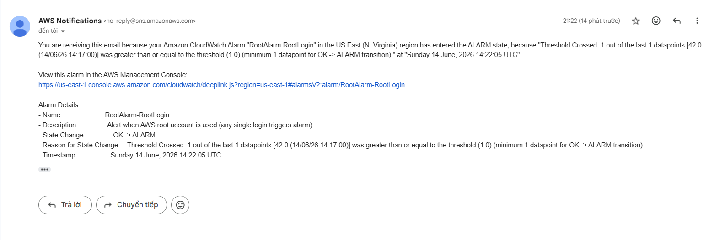
*Email từ AWS Notifications — Subject "ALARM: RootAlarm-RootLogin", nội dung cảnh báo alarm khi root account login được phát hiện*

---
